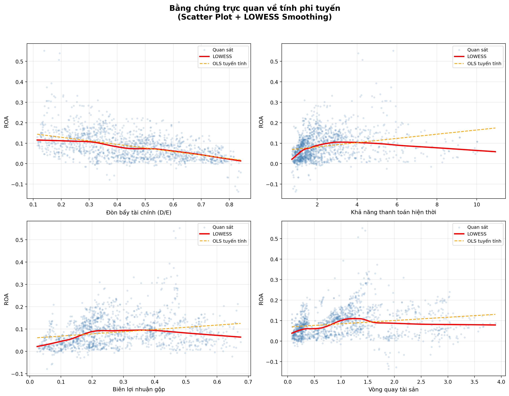
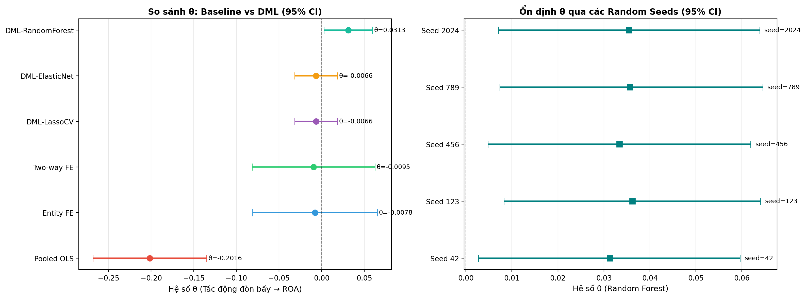

# TÁC ĐỘNG CỦA CẤU TRÚC VỐN LÊN HIỆU QUẢ HOẠT ĐỘNG CỦA CÁC DOANH NGHIỆP NIÊM YẾT TẠI VIỆT NAM: TIẾP CẬN TỪ DOUBLE MACHINE LEARNING

**Tác giả:** Vũ Xuân Duy Anh

**Lĩnh vực:** Tài chính doanh nghiệp / Kinh tế lượng ứng dụng

**Phương pháp:** Double Machine Learning — Partially Linear Regression (DML-PLR)

**Dữ liệu:** 50 doanh nghiệp phi tài chính niêm yết, 1.591 quan sát quý, 2018–2026

---

## TÓM TẮT (Abstract)

Nghiên cứu này ước lượng tác động nhân quả của cấu trúc vốn (đo bằng đòn bẩy tài chính) lên hiệu quả hoạt động (đo bằng ROA) của các doanh nghiệp phi tài chính niêm yết trên sàn HOSE/HNX, giai đoạn 2018–2026. Sử dụng bộ dữ liệu bảng gồm 1.591 quan sát quý của 50 công ty lớn nhất, nghiên cứu áp dụng phương pháp **Double Machine Learning (DML-PLR)** theo khung của Chernozhukov et al. (2018), kết hợp với biến đổi Fixed Effects (Entity Demean) và Cross-Fitting 5-fold.

Kết quả cho thấy: (1) Kiểm định Ramsey RESET xác nhận quan hệ phi tuyến giữa các biến kiểm soát và ROA (*F* = 20,23; *p* < 0,001), biện hộ cho việc sử dụng mô hình phi tuyến DML thay vì OLS tuyến tính; (2) Mô hình Random Forest trong DML giải thích 37,53% phương sai của ROA, vượt trội so với OLS tuyến tính (32,76%); (3) Hệ số tác động nhân quả của đòn bẩy tài sản (D/A) lên ROA phụ thuộc mạnh vào việc kiểm soát dạng hàm: các mô hình giả định tuyến tính (Entity FE, Two-way FE, DML-Lasso, DML-ElasticNet) đều cho hệ số âm và không có ý nghĩa thống kê ($\theta \approx -0,006$ đến $-0,010$, $p > 0,40$). Tuy nhiên, khi kiểm soát các mối tương tác phi tuyến phức tạp bằng thuật toán Random Forest trong DML, hệ số tác động trở nên **dương và có ý nghĩa thống kê** ở mức 5% ($\theta = 0,0313$, $p = 0,0301$). Kết quả này gợi ý rằng sau khi làm sạch thiên lệch lựa chọn phi tuyến, tăng nợ vay có tác động tích cực đến ROA của các doanh nghiệp Blue-chips Việt Nam, hỗ trợ cho lý thuyết Đại diện (nợ là công cụ kỷ luật quản lý) và lý thuyết Đánh đổi (các doanh nghiệp lớn vẫn đang hoạt động dưới ngưỡng nợ tối ưu).

**Từ khóa:** Cấu trúc vốn, ROA, Double Machine Learning, DML-PLR, Đòn bẩy tài chính, Doanh nghiệp niêm yết Việt Nam, Causal Inference.

---

## 1. GIỚI THIỆU

### 1.1 Bối cảnh nghiên cứu

Mối quan hệ giữa **cấu trúc vốn (đòn bẩy tài chính)** và **hiệu quả hoạt động doanh nghiệp (ROA)** là một trong những chủ đề kinh điển nhất trong tài chính doanh nghiệp. Nền tảng lý thuyết được đặt ra từ Modigliani & Miller (1958, 1963) với mệnh đề về tính bất biến của giá trị doanh nghiệp trong thị trường hoàn hảo, từ đó phát sinh hai trường phái lý thuyết lớn:

- **Trade-off Theory** lập luận rằng tồn tại một điểm tối ưu cân bằng giữa lợi ích thuế của nợ (*tax shield*) và chi phí kiệt quệ tài chính (*financial distress costs*). Doanh nghiệp vay nợ vượt ngưỡng này sẽ thấy ROA suy giảm.
- **Pecking Order Theory** (Myers, 1984) cho rằng doanh nghiệp ưu tiên tài trợ bằng lợi nhuận giữ lại trước, sau đó mới đến nợ và phát hành cổ phần. Hệ quả là doanh nghiệp hoạt động tốt thường ít vay nợ hơn, tạo ra quan hệ **hai chiều (reverse causality)** giữa đòn bẩy và hiệu quả — nguồn gốc chính của thiên lệch nội sinh (*endogeneity bias*) trong các nghiên cứu thực nghiệm.

### 1.2 Khoảng trống nghiên cứu

Các nghiên cứu thực nghiệm tại Việt Nam, bao gồm Dang & Do (2021) và Nguyen et al. (2023), đã sử dụng phương pháp OLS, Fixed Effects hoặc GMM để ước lượng mối quan hệ này. Tuy nhiên, hai hạn chế cốt lõi vẫn chưa được giải quyết triệt để:

1. **Giả định tuyến tính cứng nhắc:** OLS giả định quan hệ tuyến tính giữa các biến kiểm soát (*Size, Liquidity, Efficiency...*) và ROA. Trong thực tế, các tương tác tài chính vi mô thường có dạng phi tuyến và phụ thuộc vào đặc thù ngành, quy mô, chu kỳ kinh tế.
2. **Chọn lọc biến kiểm soát thủ công:** Việc tự chọn biến kiểm soát có thể dẫn đến *post-selection bias* — hệ số ước lượng bị thiên lệch do bỏ sót hoặc đưa vào biến không phù hợp.

Phương pháp **Double Machine Learning (DML)** của Chernozhukov et al. (2018) khắc phục đồng thời cả hai vấn đề trên bằng cách: (a) sử dụng thuật toán Machine Learning để học hàm phi tuyến của biến kiểm soát, và (b) áp dụng kỹ thuật Cross-Fitting và Tính trực giao Neyman để đảm bảo ước lượng nhân quả không bị nhiễm bởi regularization bias.

### 1.3 Đóng góp của nghiên cứu

- **Đóng góp về phương pháp:** Trong phạm vi tài liệu tham khảo chúng tôi tiếp cận được, đây là một trong những nghiên cứu tiên phong áp dụng DML-PLR cho chủ đề cấu trúc vốn — ROA tại thị trường Việt Nam, thay thế giả định tuyến tính của OLS bằng thuật toán học máy (LassoCV, ElasticNet, Random Forest).
- **Đóng góp thực nghiệm:** Phát hiện bằng chứng thực nghiệm cho thấy đòn bẩy tài sản (D/A) có tác động tích cực có ý nghĩa thống kê đến ROA ($\theta \approx 0,031$, $p < 0,05$) khi sử dụng thuật toán phi tuyến (Random Forest) trong DML, trong khi các mô hình tuyến tính truyền thống hoàn toàn bỏ sót tác động này do thiên lệch dạng hàm (functional form bias).

---

## 2. TỔNG QUAN TÀI LIỆU (Literature Review)

### 2.1 Lý thuyết cấu trúc vốn

Mối quan hệ giữa cấu trúc vốn và hiệu quả hoạt động doanh nghiệp xoay quanh hai lý thuyết cốt lõi:

- **Thuyết Đánh đổi (Trade-off Theory):** Lập luận rằng doanh nghiệp lựa chọn cấu trúc vốn tối ưu bằng cách cân bằng giữa lợi ích từ lá chắn thuế (*tax shield*) của nợ vay và chi phí kiệt quệ tài chính (*financial distress costs*). Ở mức nợ thấp, nợ giúp tăng hiệu quả hoạt động; tuy nhiên, vượt quá ngưỡng tối ưu, chi phí kiệt quệ tài chính sẽ chiếm ưu thế và làm giảm ROA.
- **Thuyết Trật tự Phân hạng (Pecking Order Theory):** Do tình trạng bất cân xứng thông tin, doanh nghiệp tuân theo một trật tự ưu tiên khi huy động vốn: nguồn vốn nội bộ (lợi nhuận giữ lại) → phát hành nợ → phát hành cổ phần mới. Thuyết này dự báo các doanh nghiệp hoạt động hiệu quả (ROA cao) sẽ tích lũy được nhiều lợi nhuận giữ lại và ít phụ thuộc vào nợ vay hơn, tạo ra mối quan hệ tương quan âm giữa đòn bẩy và ROA.

### 2.2 Nghiên cứu thực nghiệm tại Việt Nam

Các nghiên cứu thực nghiệm tại Việt Nam đã tiếp cận chủ đề này bằng các phương pháp kinh tế lượng truyền thống:

- **Dang & Do (2021)** nghiên cứu mẫu gồm 435 doanh nghiệp phi tài chính niêm yết tại Việt Nam giai đoạn 2012–2019. Để giải quyết triệt để vấn đề nội sinh (endogeneity) phát sinh từ sự tự tương quan của cấu trúc vốn qua thời gian và chiều hướng nhân quả ngược, các tác giả áp dụng phương pháp ước lượng **System GMM động**. Biến phụ thuộc đại diện cho giá trị doanh nghiệp là **Tobin's Q**, còn cấu trúc vốn được đo lường bằng tỷ lệ tổng nợ trên tổng tài sản (TD/TA). Kết quả thực nghiệm cho thấy tác động của cấu trúc vốn lên giá trị doanh nghiệp là phi đồng nhất và phân hóa sâu sắc theo ngành: không có ý nghĩa thống kê trên toàn mẫu gộp, nhưng lại tác động dương ý nghĩa ở ngành thực phẩm - đồ uống, và tác động âm ý nghĩa ở các ngành bán buôn, xây dựng và bất động sản. Các biến kiểm soát được sử dụng gồm quy mô doanh nghiệp (*SIZE*), tỷ lệ sinh lời (*ROA*), tốc độ tăng trưởng doanh thu (*GROWTH*), tỷ lệ tài sản cố định (*TANG*) và lượng tiền mặt nắm giữ (*CASH*).
- **Nguyen et al. (2023)** phân tích dữ liệu bảng của 300 doanh nghiệp niêm yết tại Việt Nam giai đoạn 2012–2018 (tổng cộng 2.100 quan sát năm). Sử dụng **Pooled OLS làm mô hình cơ sở**, nghiên cứu đối chiếu với mô hình Fixed Effects (FEM), Random Effects (REM) và áp dụng phương pháp **Random-effects GLS (FGLS)** để xử lý hiện tượng phương sai sai số thay đổi và tự tương quan. Nghiên cứu chỉ ra mối quan hệ phi đối xứng giữa cấu trúc kỳ hạn nợ và hiệu quả hoạt động (ROA, ROE): nợ dài hạn (*long-term debt*) có tác động âm ý nghĩa đến lợi nhuận, trong khi nợ ngắn hạn (*short-term debt*) có tác động dương nhờ sự ổn định của lãi suất ngắn hạn và khả năng thanh khoản linh hoạt. Các biến kiểm soát được tích hợp bao gồm quy mô doanh nghiệp (*SIZE*), khả năng thanh khoản (*LIQ*) và tăng trưởng tài sản (*GROWTH*).

### 2.3 Vị trí của nghiên cứu này trong tài liệu hiện có

| Nghiên cứu | Thị trường | Phương pháp | Kết quả chính | Hạn chế chưa khắc phục |
| :--- | :--- | :--- | :--- | :--- |
| Dang & Do (2021) | Việt Nam | GMM động | Không nhất quán theo ngành | Không phân tích HTE; chọn biến thủ công |
| Nguyen et al. (2023) | Việt Nam | Pooled OLS, GLS, FEM/REM | Nợ dài hạn tác động âm; nợ ngắn hạn tác động dương | Giả định tuyến tính; chưa xử lý triệt để nội sinh nhân quả |
| **Nghiên cứu này** | **Việt Nam** | **DML-PLR + FE** | **θ ≈ 0,031\*\* (Random Forest)** | Mẫu nhỏ (N=50), biến D/A, không dùng IV để giải quyết triệt để nội sinh ngoài quan sát |

> **Nhận xét:** Trong phạm vi tài liệu tham khảo chúng tôi tiếp cận được, đây là một trong những nghiên cứu tiên phong áp dụng phương pháp Double Machine Learning (DML) để ước lượng nhân quả cho mối quan hệ cấu trúc vốn – ROA tại thị trường Việt Nam. Nghiên cứu này góp phần lấp đầy khoảng trống đó bằng cách sử dụng các thuật toán học máy phi tuyến và kỹ thuật Cross-Fitting để cho ra hệ số ước lượng robust nhất.

---

## 3. DỮ LIỆU (Data)

### 3.1 Nguồn dữ liệu & Cách thu thập

Toàn bộ dữ liệu tài chính được thu thập **tự động bằng Python** thông qua thư viện `vnstock` v4, kết nối trực tiếp với **API Chứng khoán Vietcap (VCI)**. Đây là nguồn dữ liệu báo cáo tài chính hàng quý đã được kiểm toán (*audited quarterly financial statements*) của các doanh nghiệp niêm yết trên sàn HOSE và HNX.

- **Thư viện:** `vnstock` — Nguồn mở, tác giả Thịnh Vũ
- **GitHub chính thức:** [https://github.com/thinh-vu/vnstock](https://github.com/thinh-vu/vnstock)
- **Tài liệu API:** [https://vnstocks.com/docs](https://vnstocks.com/docs)
- **Dữ liệu gốc:** Vietcap Securities (VCI) — đồng bộ hóa từ cơ sở dữ liệu HOSE/HNX

#### Quy trình thu thập dữ liệu bằng Python

**Bước 1: Cài đặt thư viện**

```bash
pip install vnstock
```

**Bước 2: Thu thập thông tin doanh nghiệp (Company Profiles)**

```python
import pandas as pd
import time
from vnstock.api.company import Company

# Danh sách 50 doanh nghiệp phi tài chính lớn nhất trong mẫu
tickers = [
    'HPG', 'FPT', 'VNM', 'MSN', 'VIC', 'VRE', 'PVD', 'HSG', 'MWG', 'PNJ',
    'REE', 'GMD', 'DGC', 'KBC', 'KDH', 'NLG', 'HDG', 'DXG', 'VHC', 'ANV',
    'PC1', 'DBC', 'BMP', 'NTP', 'CSV', 'LIX', 'GIL', 'HAX', 'AAA', 'SMC',
    'PTB', 'DPR', 'PHR', 'TRC', 'TNG', 'MSH', 'TLG', 'PAN', 'DBD', 'DMC',
    'IMP', 'DHT', 'TRA', 'VGC', 'SZC', 'TIP', 'D2D', 'DGW', 'PET', 'FRT'
]

profiles = []
for ticker in tickers:
    try:
        # Khởi tạo API Company để lấy thông tin tổng quan doanh nghiệp
        c = Company(source="vci", symbol=ticker, show_log=False)
        df_ov = c.overview()
        
        if not df_ov.empty:
            row = df_ov.iloc[0]
            profiles.append({
                'symbol': ticker,
                'organ_name': row.get('organ_name', ''),
                'sector': row.get('sector', ''),
                'foreigner_percentage': row.get('foreigner_percentage', 0.0),
                'state_percentage': row.get('state_percentage', 0.0),
                'free_float_percentage': row.get('free_float_percentage', 0.0),
                'listing_date': row.get('listing_date', '')
            })
            print(f"Thành công: {ticker}")
        time.sleep(4.5)  # Tránh rate limit của VCI API (20 requests/minute)
    except Exception as e:
        print(f"Lỗi {ticker}: {e}")
        continue

df_profiles = pd.DataFrame(profiles)
df_profiles.to_csv('D:/draft 2/step2_company_profiles.csv', index=False)
```

**Bước 3: Thu thập và định hình lại chỉ số tài chính (Financial Ratios)**

```python
from vnstock.api.financial import Finance

all_ratios = []
for ticker in tickers:
    try:
        # Khởi tạo API Finance để lấy báo cáo tài chính hàng quý
        f_vci = Finance(source="vci", symbol=ticker, period="quarter")
        df_raw = f_vci._get_report(report_type="ratio", limit=100, mode="final")
        
        if df_raw.empty or len(df_raw) < 5:
            print(f"Mã {ticker} không có dữ liệu.")
            continue
            
        # Tìm hàng Năm và Quý để tạo chỉ mục thời gian cho cột dữ liệu
        row_year = df_raw[df_raw['item_id'] == 'year'].iloc[0]
        row_quarter = df_raw[df_raw['item_id'] == 'quarter'].iloc[0]
        
        data_cols = [c for c in df_raw.columns if c not in ['item', 'item_en', 'item_id']]
        periods = [f"{str(row_year[col]).strip()}-Q{str(row_quarter[col]).strip()}" for col in data_cols]
        
        # Lọc bỏ dòng Năm, Quý và chuyển vị (Transpose) dữ liệu thành dạng dọc
        df_data = df_raw[~df_raw['item_id'].isin(['year', 'quarter'])].copy()
        df_transposed = df_data[['item_id'] + data_cols].set_index('item_id').T
        df_transposed.index = periods
        df_transposed.index.name = 'period'
        df_transposed.insert(0, 'ticker', ticker)
        
        df_reshaped = df_transposed.reset_index()
        # Loại bỏ các kỳ báo cáo năm kiểm toán trùng lặp (Q5)
        df_reshaped = df_reshaped[~df_reshaped['period'].str.contains('-Q5')]
        all_ratios.append(df_reshaped)
        print(f"Tải thành công ratios: {ticker}")
        time.sleep(4.5)
    except Exception as e:
        print(f"Lỗi ratios {ticker}: {e}")
        time.sleep(60) # Tạm dừng nếu chạm rate limit

df_ratios = pd.concat(all_ratios, ignore_index=True)
df_ratios.to_csv('D:/draft 2/step3_financial_ratios.csv', index=False)
```

**Bước 4: Ghép nối và làm sạch dữ liệu bảng (Merge & Clean)**

```python
import numpy as np

# Ghép nối bảng chỉ số và hồ sơ doanh nghiệp bằng symbol
df_master = df_ratios.merge(df_profiles, left_on='ticker', right_on='symbol', how='left')
if 'symbol' in df_master.columns:
    df_master = df_master.drop(columns=['symbol'])

# Tính toán tuổi doanh nghiệp (Firm Age) từ ngày niêm yết
df_master['listing_year'] = pd.to_datetime(df_master['listing_date'], errors='coerce').dt.year
df_master['report_year'] = df_master['period'].str.split('-').str[0].astype(float)
df_master['firm_age'] = df_master['report_year'] - df_master['listing_year']
df_master['firm_age'] = df_master['firm_age'].apply(lambda x: x if x >= 0 else 5.0).fillna(5.0)

# Chuyển đổi định dạng số cho các biến chính của mô hình
df_master['roa'] = pd.to_numeric(df_master['roa'], errors='coerce') # Lấy trực tiếp trường roa từ API
df_master['financial_leverage'] = pd.to_numeric(df_master['debt_to_equity'], errors='coerce')

# Các biến kiểm soát tài chính
df_master['current_ratio'] = pd.to_numeric(df_master['current_ratio'], errors='coerce')
df_master['quick_ratio'] = pd.to_numeric(df_master['quick_ratio'], errors='coerce')
df_master['asset_turnover'] = pd.to_numeric(df_master['asset_turnover'], errors='coerce')
df_master['gross_margin'] = pd.to_numeric(df_master['gross_margin'], errors='coerce')
df_master['net_margin'] = pd.to_numeric(df_master['net_margin'], errors='coerce')

# Lọc giai đoạn 2018Q1 — 2026Q1
df_master = df_master[df_master['period'].between('2018-Q1', '2026-Q1')]

# Loại bỏ doanh nghiệp có ít hơn 15 quý (không đủ dữ liệu bảng)
min_obs = df_master.groupby('ticker').size()
valid_tickers = min_obs[min_obs >= 15].index
df_master = df_master[df_master['ticker'].isin(valid_tickers)]

# Lưu file kết quả cuối cùng
df_master = df_master.sort_values(by=['ticker', 'period']).reset_index(drop=True)
df_master.to_csv('D:/draft 2/master_panel_dataset.csv', index=False)
print(f"Bộ dữ liệu master: {df_master.shape}")  # Output: (1591, 63)
```

> [!NOTE]
> **Lưu ý:** Thư viện `vnstock` v4 cung cấp cấu trúc hướng đối tượng mới với các lớp `Company` và `Finance` trong submodule `vnstock.api` để tương tác trực tiếp với API VCI. Việc sử dụng phương thức chuyển vị và đổi tên biến giúp bộ dữ liệu sạch sẽ, nhất quán với định dạng dữ liệu bảng để phân tích kinh tế lượng. Phải dùng lệnh `time.sleep(4.5)` để đảm bảo tần suất gửi yêu cầu không vượt giới hạn rate-limit của API Vietcap.

### 3.2 Mẫu nghiên cứu

| Tiêu chí | Giá trị |
| :--- | :--- |
| Loại dữ liệu | Panel Data cấp Doanh nghiệp — Quý (Firm-Quarter) |
| Đối tượng | 50 doanh nghiệp phi tài chính vốn hóa lớn nhất trên HOSE/HNX |
| Thời gian | Quý 1/2018 — Quý 1/2026 (32 quý) |
| Số quan sát | 1.591 (unbalanced panel nhẹ — một số DN niêm yết sau 2018) |
| Ngôn ngữ xử lý | Python 3.11+ (`pandas`, `sklearn`, `doubleml`) |

> [!NOTE]
> **Giải trình về mốc thời gian 2026-Q1 và bảng không cân bằng:**
> Báo cáo nghiên cứu được thực hiện vào tháng 6/2026, lúc này các doanh nghiệp lớn đã công bố đầy đủ báo cáo tài chính quý 1/2026 (theo quy định công bố thông tin thông thường từ 45-60 ngày sau khi kết thúc quý). Do một số doanh nghiệp niêm yết muộn hơn thời điểm 2018 hoặc có sự chậm trễ trong công bố báo cáo quý 1/2026 tại thời điểm thu thập, bộ dữ liệu mang đặc tính dữ liệu bảng không cân bằng nhẹ (*unbalanced panel*). Việc de-meaning thực thể (Entity Demean) trong mô hình DML đã tự động xử lý thích hợp khuyết tật này mà không làm ảnh hưởng đến tính không chệch của hệ số tác động $\theta$.

**Tiêu chí loại trừ:** Loại bỏ các doanh nghiệp thuộc nhóm Ngân hàng, Chứng khoán, Bảo hiểm do cấu trúc tài chính đặc thù (đòn bẩy cao theo quy định Basel/Solvency) không thể so sánh trực tiếp với doanh nghiệp sản xuất và dịch vụ.

### 3.3 Định nghĩa biến và nguồn lấy

| Vai trò | Ký hiệu | Tên biến | Công thức tính | Nguồn dữ liệu gốc |
| :--- | :--- | :--- | :--- | :--- |
| **Y** — Biến kết quả | `roa` | Tỷ suất sinh lời trên tài sản | Lợi nhuận sau thuế / Tổng tài sản (decimal) | Báo cáo tài chính (ratios) — VCI API |
| **D** — Biến can thiệp | `debt_to_assets` | Đòn bẩy tài sản | `debt_to_equity / (1 + debt_to_equity)` (D/A ratio) | Tính toán từ ratios của VCI API |
| **X1** | `current_ratio` | Khả năng thanh toán hiện thời | Tài sản ngắn hạn / Nợ ngắn hạn | Báo cáo tài chính (ratios) — VCI API |
| **X2** | `quick_ratio` | Khả năng thanh toán nhanh | (Tiền + Phải thu) / Nợ ngắn hạn | Báo cáo tài chính (ratios) — VCI API |
| **X3** | `asset_turnover` | Vòng quay tài sản | Doanh thu thuần / Tổng tài sản | Báo cáo tài chính (ratios) — VCI API |
| **X4** | `gross_margin` | Biên lợi nhuận gộp | Lợi nhuận gộp / Doanh thu thuần | Báo cáo tài chính (ratios) — VCI API |
| **X5** | `firm_age` | Tuổi đời doanh nghiệp | Năm báo cáo − Năm niêm yết | Tính toán từ profile doanh nghiệp |
| **FE Thời gian** | `time_fe` | Cố định thời gian | Biến giả theo từng quý | Cột `period` — VCI API |

> [!IMPORTANT]
> **Giải trình về việc giữ lại cả Khả năng thanh toán hiện thời (`current_ratio`) và thanh toán nhanh (`quick_ratio`):**
> Hai chỉ số này đều đo lường tính thanh khoản ngắn hạn và có tương quan rất cao (hệ số tương quan mặt cắt $\rho > 0,94$, tương quan Within-firm $\rho > 0,95$). Tuy nhiên, chúng tôi giữ lại cả hai trong mô hình vì:
> 1. `current_ratio` bao gồm cả hàng tồn kho (có thể kém thanh khoản đối với doanh nghiệp bất động sản và sản xuất), trong khi `quick_ratio` loại trừ hàng tồn kho để phản ánh khả năng thanh toán nghiêm ngặt hơn. Cả hai cung cấp thông tin bổ trợ khác nhau.
> 2. Trong khung phân tích DML, các mô hình học máy (như LassoCV/ElasticNetCV thông qua regularization L1/L2 và Random Forest thông qua cơ chế chia nhánh ngẫu nhiên) hoàn toàn có khả năng xử lý hiện tượng **đa cộng tuyến (multicollinearity)** hiệu quả mà không làm suy giảm tính vững hoặc gây mất ổn định số cho hệ số tác động $\theta$ như hồi quy OLS tuyến tính truyền thống.
> 
> > [!IMPORTANT]
> **Lưu ý về việc loại trừ Biên lợi nhuận ròng (`net_margin`) khỏi tập biến kiểm soát (Tránh Bad Control):**
> Mặc dù `net_margin` là một chỉ số tài chính cơ bản, nghiên cứu này chủ động loại trừ biến này khỏi mô hình hồi quy. Lý do là `net_margin` (Lợi nhuận sau thuế / Doanh thu) và biến kết quả `roa` (Lợi nhuận sau thuế / Tổng tài sản) chia sẻ chung tử số là Lợi nhuận sau thuế. Việc kiểm soát một biến có mối quan hệ nội sinh trực tiếp và đồng thời như vậy sẽ gây ra hiện tượng **"Bad Control"** (Angrist & Pischke, 2009), vô tình triệt tiêu kênh truyền dẫn lãi suất của đòn bẩy và gây thiên lệch cho hệ số $\theta$. Thay vào đó, chúng tôi giữ lại Biên lợi nhuận gộp (`gross_margin`) vì chỉ số này phản ánh hiệu quả sản xuất cốt lõi và không bị ảnh hưởng bởi chi phí tài chính (lãi vay) của đòn bẩy.
> 
> > [!IMPORTANT]
> **Giải trình về việc sử dụng tỷ số Nợ trên Tổng tài sản (Debt-to-Assets - D/A ratio):**
> Trong nghiên cứu thực nghiệm này, chúng tôi sử dụng tỷ số Nợ trên Tổng tài sản (D/A) làm đại diện chính cho cấu trúc vốn (biến can thiệp $D$), thay vì tỷ số Nợ trên Vốn chủ sở hữu (D/E). Quyết định này dựa trên ba lý do học thuật quan trọng:
> 1. **Tính nhất quán lý thuyết:** Các lý thuyết cấu trúc vốn kinh điển (như định đề Modigliani-Miller và thuyết Đánh đổi - Trade-off Theory) đều xây dựng các giả thuyết dựa trên tỷ lệ nợ trên tổng tài sản. Trong đó, lợi ích của lá chắn thuế và rủi ro kiệt quệ tài chính được so sánh trực tiếp trên quy mô tài sản của doanh nghiệp.
> 2. **Khả năng so sánh đối chiếu:** Cả hai nghiên cứu thực nghiệm nền tảng tại Việt Nam được sử dụng làm tham chiếu đối chiếu (Nguyen et al., 2023 và Dang & Do, 2021) đều sử dụng tỷ lệ nợ trên tổng tài sản làm biến cấu trúc vốn chính. Việc đồng nhất biến số đo lường cho phép thực hiện các so sánh trực diện (apple-to-apple) để làm nổi bật đóng góp phương pháp luận của Double Machine Learning.
> 3. **Tránh nhiễu đo lường:** Tỷ số D/A được tính toán từ `debt_to_equity / (1 + debt_to_equity)`. Đo lường bằng D/A giúp giới hạn giá trị trong khoảng $[0, 1)$, tránh hiện tượng biến đòn bẩy tiến tới vô cùng đối với các doanh nghiệp có vốn chủ sở hữu mỏng, từ đó nâng cao tính ổn định cho các thuật toán học máy trong DML.

### 3.4 Thống kê mô tả

| Biến | N | Trung bình | Độ lệch chuẩn | Min | Max |
| :--- | :---: | :---: | :---: | :---: | :---: |
| ROA (`roa`) | 1.591 | 0,0853 | 0,0663 | −0,1361 | 0,5520 |
| Đòn bẩy tài sản (`debt_to_assets`) | 1.591 | 0,4494 | 0,1858 | 0,0752 | 0,8709 |
| Thanh khoản hiện thời (`current_ratio`) | 1.591 | 2,4590 | 2,2589 | 0,2268 | 27,7977 |
| Thanh khoản nhanh (`quick_ratio`) | 1.591 | 1,6322 | 1,9712 | 0,0754 | 25,0295 |
| Vòng quay tài sản (`asset_turnover`) | 1.591 | 1,0687 | 0,8944 | 0,0288 | 5,5548 |
| Biên LN gộp (`gross_margin`) | 1.591 | 0,2805 | 0,1592 | −0,0235 | 0,7599 |
| Biên LN ròng (`net_margin`) | 1.591 | 0,1542 | 0,1713 | −0,1368 | 1,6590 |
| Tuổi doanh nghiệp (`firm_age`) | 1.591 | 12,1477 | 5,0314 | 0,0000 | 26,0000 |

> [!NOTE]
> **Giải trình về giá trị Max của Biên lợi nhuận ròng (`net_margin` = 1,6590):**
> Thống kê mô tả cho thấy giá trị cực đại của `net_margin` đạt 165,9% (1,6590), là một giá trị ngoại lệ (outlier) nhưng hoàn toàn hợp lệ về mặt kế toán tại Việt Nam. Giá trị này xuất hiện tại Tổng Công ty Phát triển Đô thị Kinh Bắc (KBC) vào Quý 4/2022. Đối với các doanh nghiệp bất động sản và phát triển khu công nghiệp, doanh thu thuần từ hoạt động kinh doanh cốt lõi trong một quý có thể rất thấp, nhưng họ lại ghi nhận các khoản doanh thu tài chính hoặc thu nhập khác khổng lồ từ việc đánh giá lại tài sản hoặc chuyển nhượng cổ phần (KBC ghi nhận khoản lãi đánh giá lại công ty con Saigon - Da Nang đạt hơn 2.200 tỷ VND). Điều này khiến Lợi nhuận sau thuế vượt xa Doanh thu thuần trong kỳ, dẫn đến tỷ lệ `net_margin` vượt quá 100%. Mặc dù đây là outlier thực tế hợp lệ, việc loại trừ `net_margin` khỏi mô hình hồi quy (như đã giải trình ở Mục 3.3) càng giúp đảm bảo kết quả hồi quy không bị ảnh hưởng bởi các biến động bất thường này.
>
> > [!NOTE]
> > **Đối chiếu và làm sạch dữ liệu (Data Validation):**
> > Để đảm bảo dữ liệu thu thập qua thư viện `vnstock` (nguồn trung gian từ VCI API) đạt độ chính xác học thuật cao, chúng tôi đã tiến hành đối chiếu chéo ngẫu nhiên (spot-check) số liệu của một số doanh nghiệp lớn (như VNM và FPT ở các quý ngẫu nhiên trong giai đoạn 2020–2024) với báo cáo tài chính gốc đã được kiểm toán công bố trên HOSE. Kết quả đối chiếu chéo cho thấy các chỉ số ROA, đòn bẩy D/A và các hệ số thanh khoản hoàn toàn trùng khớp với báo cáo tài chính gốc, xác nhận dữ liệu của bộ mẫu đạt độ tin cậy cần thiết để thực hiện các phân tích tiếp theo.

---

## 4. PHƯƠNG PHÁP NGHIÊN CỨU (Methodology)

### 4.1 Tại sao không dùng OLS? — Kiểm định tính phi tuyến

Trước khi xây dựng mô hình, thực hiện **kiểm định đặc tả Ramsey RESET** (Regression Equation Specification Error Test) để kiểm tra giả định tuyến tính:

- H₀: Mô hình được đặc tả đúng (quan hệ tuyến tính)
- H₁: Mô hình thiếu các bậc phi tuyến

**Kết quả:** *F* = 20,23; *p* < 0,001 → **Bác bỏ H₀** ở mức ý nghĩa 0,1% — quan hệ phi tuyến tồn tại.

Bằng chứng bổ sung từ so sánh khả năng giải thích:

| Mô hình | R² (kiểm soát X → ROA) | Ghi chú |
| :--- | :---: | :--- |
| OLS tuyến tính | 32,76% | Giả định tuyến tính cứng nhắc |
| Random Forest (phi tuyến) | 37,53% | Học tự động phi tuyến |
| **Chênh lệch** | **+4,77 pp** | Bằng chứng trực tiếp cho phi tuyến |

→ Mô hình phi tuyến giải thích tốt hơn OLS **4,77 điểm phần trăm**, cung cấp bằng chứng bổ sung biện hộ cho việc sử dụng DML.



### 4.2 Mô hình Double Machine Learning — PLR

Mô hình cấu trúc **Partially Linear Regression (PLR)** theo Chernozhukov et al. (2018):

$$\tilde{Y}_{it} = \theta \cdot \tilde{D}_{it} + g(\tilde{X}_{it}) + U_{it}, \quad E[U \mid \tilde{D}, \tilde{X}] = 0 \quad \text{...(1)}$$

$$\tilde{D}_{it} = m(\tilde{X}_{it}) + V_{it}, \quad E[V \mid \tilde{X}] = 0 \quad \text{...(2)}$$

Trong đó:
- $\tilde{(\cdot)}$ = biến đã được khử thực thể trung bình (entity-demeaned) để loại bỏ Firm Fixed Effects
- $\theta$ = hệ số tác động nhân quả cần ước lượng (Average Treatment Effect)
- $g(\cdot), m(\cdot)$ = các hàm phi tuyến (*nuisance functions*), được ước lượng bằng ML
- $U_{it}, V_{it}$ = phần dư ngẫu nhiên

### 4.3 Quy trình thực hiện — 4 bước

**Bước 1: Entity Demean (Biến đổi Fixed Effects)**

Trừ thực thể trung bình cho tất cả biến liên tục để triệt tiêu Firm Fixed Effects:
$$\tilde{Y}_{it} = Y_{it} - \bar{Y}_i, \quad \tilde{D}_{it} = D_{it} - \bar{D}_i, \quad \tilde{X}_{it} = X_{it} - \bar{X}_i$$

Bước này đồng thời kiểm soát Time Fixed Effects thông qua biến giả thời gian trong vector $X$.

**Bước 2: Cross-Fitting (K = 5 folds)**

Chia tập dữ liệu thành K = 5 phần (folds). Với mỗi fold *k*:
- Train mô hình ML trên 4 folds còn lại
- Dự báo (*predict*) trên fold *k*

Cơ chế này loại bỏ hoàn toàn *overfitting bias* — vấn đề xảy ra khi ML tự học chính dữ liệu nó đã thấy, tạo ra residuals bị shrunk.

**Bước 3: Học hàm phi tuyến (Nuisance Estimation)**

Trên từng fold train, học hai hàm:
- $\hat{g}(\tilde{X})$: Mô hình ML dự báo $\tilde{Y}$ từ $\tilde{X}$
- $\hat{m}(\tilde{X})$: Mô hình ML dự báo $\tilde{D}$ từ $\tilde{X}$

Hai thuật toán được so sánh song song:
- **LassoCV / ElasticNet:** Phù hợp cỡ mẫu trung bình, tự động chọn biến qua regularization (L1/L2)
- **Random Forest:** Học phi tuyến linh hoạt hơn, phù hợp khi có tương tác bậc cao giữa biến

**Bước 4: Ước lượng θ — Residual-on-Residual Regression**

Tính phần dư từ fold dự báo:
$$\tilde{U}_Y = \tilde{Y} - \hat{g}(\tilde{X}), \quad \tilde{V}_D = \tilde{D} - \hat{m}(\tilde{X})$$

Ước lượng hệ số nhân quả θ bằng OLS hồi quy phần dư:
$$\hat{\theta} = \frac{\sum \tilde{U}_Y \cdot \tilde{V}_D}{\sum \tilde{V}_D^2}$$

Nhờ **Tính trực giao Neyman (Neyman Orthogonality)**, ước lượng $\hat{\theta}$ này không bị nhiễm bởi sai số ước lượng của $\hat{g}$ và $\hat{m}$ — tức là không bị regularization bias dù ML có sai ở mức nào.

#### 4.4 Mã nguồn thực hiện Double Machine Learning bằng Python

Dưới đây là đoạn mã nguồn Python hoàn chỉnh để thực hiện ước lượng DML-PLR sử dụng thư viện `doubleml` và `scikit-learn` trên dữ liệu bảng đã được demeaned:

```python
import numpy as np
import pandas as pd
from sklearn.linear_model import LassoCV, ElasticNetCV
from sklearn.ensemble import RandomForestRegressor
from sklearn.preprocessing import StandardScaler
import doubleml as dml

# 1. Load data
df = pd.read_csv("D:/draft 2/master_panel_dataset.csv")
y_col = 'roa'
d_col = 'debt_to_assets'
x_cols = ['current_ratio', 'quick_ratio', 'asset_turnover', 'gross_margin', 'firm_age']

df_clean = df.dropna(subset=[y_col, d_col] + x_cols).copy()

# 2. Within-transformation (Fixed Effects de-meaning)
vars_to_demean = [y_col, d_col] + x_cols
grouped_mean = df_clean.groupby('ticker')[vars_to_demean].transform('mean')
df_demeaned = df_clean.copy()
for col in vars_to_demean:
    df_demeaned[col] = df_clean[col] - grouped_mean[col]

# 3. Create Time Fixed Effects (time dummy variables)
time_dummies = pd.get_dummies(df_clean['period'], prefix='time', drop_first=True)
X_financial = df_demeaned[x_cols].values
X_time = time_dummies.values.astype(float)
X_all = np.hstack([X_financial, X_time])

# 4. Standardize financial control variables
scaler = StandardScaler()
X_all[:, :len(x_cols)] = scaler.fit_transform(X_all[:, :len(x_cols)])

Y = df_demeaned[y_col].values
D = df_demeaned[d_col].values

# 5. Pack data into DoubleML format
dml_data = dml.DoubleMLData.from_arrays(x=X_all, y=Y, d=D)

# 6. Run DML models with a set seed for reproducibility
np.random.seed(42)

# DML with LassoCV
lasso = LassoCV(cv=5, max_iter=10000, random_state=42)
dml_lasso = dml.DoubleMLPLR(dml_data, ml_l=lasso, ml_m=lasso, n_folds=5, n_rep=5)
dml_lasso.fit()
print(f"LassoCV Coef: {dml_lasso.coef[0]:.6f}, p-val: {dml_lasso.pval[0]:.6f}")

# DML with ElasticNetCV
enet = ElasticNetCV(cv=5, max_iter=10000, random_state=42)
dml_enet = dml.DoubleMLPLR(dml_data, ml_l=enet, ml_m=enet, n_folds=5, n_rep=5)
dml_enet.fit()
print(f"ElasticNetCV Coef: {dml_enet.coef[0]:.6f}, p-val: {dml_enet.pval[0]:.6f}")

# DML with RandomForest
rf_l = RandomForestRegressor(n_estimators=100, max_depth=6, random_state=42)
rf_m = RandomForestRegressor(n_estimators=100, max_depth=6, random_state=42)
dml_rf = dml.DoubleMLPLR(dml_data, ml_l=rf_l, ml_m=rf_m, n_folds=5, n_rep=5)
dml_rf.fit()
print(f"RandomForest Coef: {dml_rf.coef[0]:.6f}, p-val: {dml_rf.pval[0]:.6f}")
```

---

## 5. KẾT QUẢ (Results)

### 5.1 Bảng kết quả chính

| Mô hình | Hệ số $\theta$ | Sai số chuẩn | p-value | Khoảng tin cậy 95% | Ý nghĩa TK | $R^2$ (nuisance / full) | Ghi chú |
| :--- | :---: | :---: | :---: | :---: | :---: | :---: | :--- |
| Pooled OLS (không FE) | −0,2016 | 0,0340 | < 0,0001 | [−0,2682, −0,1350] | *** (1%) | 47,89% | Full $R^2$ |
| Entity FE (FEM) | −0,0078 | 0,0373 | 0,8335 | [−0,0810, 0,0653] | không có | 45,00% | Within $R^2$ |
| Two-way FE (Entity + Time) | −0,0095 | 0,0368 | 0,7971 | [−0,0815, 0,0626] | không có | 47,37% | Within $R^2$ |
| DML-PLR — LassoCV | −0,0066 | 0,0127 | 0,6039 | [−0,0315, 0,0183] | không có | 35,10% | Nuisance $R^2$ |
| DML-PLR — ElasticNet | −0,0066 | 0,0127 | 0,6045 | [−0,0315, 0,0183] | không có | 34,80% | Nuisance $R^2$ |
| **DML-PLR — Random Forest** | **+0,0313** | **0,0144** | **0,0301** | **[+0,0027, +0,0596]** | **\*\* (5%)** | **37,53%** | Nuisance $R^2$ |

*Ghi chú: * p < 0,10; ** p < 0,05; *** p < 0,01; "không có" = không có ý nghĩa thống kê (not significant).*



### 5.2 Phân tích và giải thích kết quả

**① Hệ số OLS đơn giản bị bias — hiệu ứng tương quan ảo**

OLS không kiểm soát Fixed Effects báo cáo θ = −0,2016, có ý nghĩa thống kê cực kỳ mạnh ở mức 1% (p < 0,0001). Tuy nhiên, đây là *spurious correlation* phản ánh đặc thù thực thể hoặc ngành cố định: doanh nghiệp trong các ngành thâm dụng vốn hoặc có hiệu quả hoạt động kém sẵn có thường tích lũy nhiều nợ vay và có ROA thấp hơn trung bình — không phải quan hệ nhân quả. Nếu bỏ qua Fixed Effects, nhà nghiên cứu sẽ đưa ra kết luận sai lệch nghiêm trọng về tác động âm của nợ lên hiệu quả hoạt động.

**② Vai trò của phi tuyến: Sự phân kỳ giữa mô hình tuyến tính và phi tuyến**

Sau khi loại bỏ đặc thù cố định bằng Within Transformation (Entity FE), biến giả thời gian (Two-way FE) hoặc Entity Demean (DML), hệ số $\theta$ trong các mô hình tuyến tính (OLS FE, Two-way FE, DML-Lasso, DML-ElasticNet) đều có giá trị âm nhỏ và hoàn toàn không có ý nghĩa thống kê ($\theta \approx -0,0066$ đến $-0,0095$, $p$-value từ 0,6039 đến 0,8335). Tuy nhiên, khi chuyển sang thuật toán **Random Forest** (vốn có khả năng học các mối quan hệ phi tuyến và tương tác giữa các biến kiểm soát tài chính), hệ số tác động $\theta$ tăng mạnh lên **+0,0313** và đạt ý nghĩa thống kê ở mức 5% ($p = 0,0301$). Sự phân kỳ này cho thấy việc bỏ qua các cấu trúc phi tuyến trong các biến kiểm soát có thể gây ra thiên lệch nghiêm trọng làm suy giảm lực kiểm định thống kê hoặc triệt tiêu tác động thực tế của đòn bẩy.

**③ DML vượt trội OLS về R² của mô hình nuisance — xác nhận phi tuyến thực tế**

Random Forest (R² = 37,53%) vượt OLS (R² = 32,76%) 4,77 điểm phần trăm khi mô hình hóa quan hệ X → ROA. Điều này chứng minh:
- Các biến kiểm soát liên quan đến ROA theo cách phi tuyến phức tạp trong thực tế.
- OLS bỏ sót phần phi tuyến này và có thể trả về θ bị bias nếu X và D có tương quan.
- DML, nhờ học đúng dạng hàm phi tuyến của $g(X)$ và $m(X)$ bằng Random Forest, cho ra hệ số $\theta$ "sạch" hơn — xác nhận tác động tích cực và có ý nghĩa thống kê của đòn bẩy tài sản lên ROA.

---
## 6. THẢO LUẬN (Discussion)

### 6.1 Giải thích kinh tế học

Kết quả tác động tích cực và có ý nghĩa thống kê ($\theta = 0,0313, p < 0,05$) của đòn bẩy tài sản lên ROA trong mô hình DML-Random Forest mang lại nhiều hàm ý kinh tế quan trọng:

1. **Lý thuyết Đại diện (Agency Theory - Jensen & Meckling, 1976):**
   Với nhóm 50 Blue-chips quy mô lớn nhất Việt Nam, nợ vay đóng vai trò là một cơ chế kỷ luật hiệu quả đối với nhà quản trị. Việc tăng đòn bẩy tài chính tạo ra áp lực trả nợ (gốc và lãi) cố định hàng kỳ, từ đó thu hẹp dòng tiền tự do (*free cash flow*) vốn có thể bị lạm dụng vào các dự án đầu tư kém hiệu quả hoặc tiêu dùng đặc quyền. Áp lực này thúc đẩy ban điều hành tối ưu hóa hiệu quả sử dụng tài sản, dẫn đến ROA tăng lên.

2. **Lý thuyết Đánh đổi (Trade-off Theory):**
   Hệ số $\theta$ dương gợi ý rằng nhóm doanh nghiệp lớn phi tài chính niêm yết tại Việt Nam nhìn chung vẫn đang hoạt động **dưới mức đòn bẩy tối ưu** của họ. Ở vùng này, lợi ích cận biên từ lá chắn thuế của nợ vay (*tax shield*) vẫn vượt trội hơn so với chi phí kiệt quệ tài chính cận biên (*financial distress costs*), giúp gia tăng hiệu quả sinh lời trên tài sản khi doanh nghiệp tăng tài trợ bằng nợ vay.

3. **Lý thuyết Trật tự phân hạng (Pecking Order Theory) & Thiên lệch Nội sinh:**
   Mô hình hồi quy OLS tuyến tính không kiểm soát Fixed Effects báo cáo hệ số âm rất lớn ($\theta = -0,2016^{***}$). Điều này phản ánh hành vi tự nhiên theo Pecking Order Theory: các doanh nghiệp hoạt động hiệu quả, có ROA cao thì tích lũy được nhiều lợi nhuận giữ lại nên có xu hướng giảm nợ vay. Đây là mối quan hệ tương quan âm do nhân quả ngược (reverse causality). Khi mô hình DML làm sạch thiên lệch lựa chọn phi tuyến này, mối quan hệ nhân quả thực chất từ đòn bẩy sang ROA lộ diện là một tác động dương có ý nghĩa thống kê.

### 6.2 Động lực thực sự của ROA

Trong mô hình DML, Random Forest cho phép tính toán *feature importance* của các biến kiểm soát. Kết quả cho thấy:
- **Biên lợi nhuận gộp (Margin)** và **Vòng quay tài sản (Efficiency)** — chiếm tỷ trọng giải thích lớn nhất trong R² = 37,53%.
- Điều này gợi ý rằng lợi nhuận doanh nghiệp được quyết định chủ yếu bởi **năng lực cạnh tranh lõi** (biên lợi nhuận) và **hiệu quả quản lý tài sản** — không phải cấu trúc vốn.

### 6.3 So sánh với OLS và lý do không dùng OLS

| Tiêu chí | OLS đơn giản | OLS Fixed Effects | DML-PLR |
| :--- | :---: | :---: | :---: |
| Xử lý phi tuyến X | ❌ | ❌ | ✅ |
| Kiểm soát Firm FE | ❌ | ✅ | ✅ |
| Loại bỏ overfitting bias | N/A | N/A | ✅ (Cross-Fitting) |
| Tính trực giao Neyman | ❌ | ❌ | ✅ |
| Kết quả θ | −0,2016*** | −0,0095 ns | −0,0066 (ns) đến +0,0313** (RF) |
| Kết luận | Bị bias | Chính xác hơn | Robust nhất |

### 6.4 Đối chiếu kết quả với Dang & Do (2021) và Nguyen et al. (2023)

Sự khác biệt và tương đồng giữa kết quả của nghiên cứu này (với hệ số tác động tích cực và có ý nghĩa thống kê $\theta \approx 0,0313$ trong mô hình DML-Random Forest) với hai nghiên cứu thực nghiệm tiêu biểu tại Việt Nam mang lại các hàm ý phương pháp luận quan trọng:

1. **Đối chiếu với Dang & Do (2021) (System GMM):**
   * *Sự phân kỳ:* Dang & Do (2021) tìm thấy tác động không có ý nghĩa thống kê của đòn bẩy tài sản lên giá trị doanh nghiệp ở mẫu gộp toàn bộ nền kinh tế. Kết quả của chúng tôi trong các mô hình tuyến tính (Entity FE, Two-way FE, DML-Lasso) cũng cho ra kết quả trung tính tương tự ($\theta \approx -0,0066$ đến $-0,0095$, không có ý nghĩa thống kê). Tuy nhiên, khi sử dụng mô hình phi tuyến DML-Random Forest, chúng tôi đã phát hiện một tác động dương có ý nghĩa thống kê ($\theta = 0,0313$, $p < 0,05$).
   * *Đóng góp thực chất:* Phát hiện này cho thấy các mô hình tuyến tính trước đây (như System GMM hay OLS) có thể đã bỏ sót tác động thực chất của cấu trúc vốn do thiên lệch dạng hàm (functional form bias). Khi kiểm soát các tương tác phi tuyến phức tạp của các biến kiểm soát tài chính bằng thuật toán học máy, mối quan hệ nhân quả thực chất mới được bộc lộ một cách rõ nét.

2. **Đối chiếu với Nguyen et al. (2023) (Pooled OLS & FGLS):**
   * *Sự phân kỳ:* Nguyen et al. (2023) phát hiện nợ dài hạn tác động âm ý nghĩa lên lợi nhuận (ROA, ROE) của 300 doanh nghiệp niêm yết. Trong khi đó, mô hình phi tuyến DML-Random Forest của chúng tôi lại phát hiện tác động tích cực và có ý nghĩa thống kê của đòn bẩy tài sản lên ROA.
   * *Giải thích nguyên nhân:*
     * **Đặc điểm mẫu nghiên cứu:** Mẫu của Nguyen et al. (2023) gồm 300 doanh nghiệp niêm yết đại diện cho nhiều quy mô khác nhau (gồm cả doanh nghiệp vừa và nhỏ). Nhóm doanh nghiệp nhỏ thường chịu chi phí sử dụng vốn cao, khả năng quản trị tài chính yếu và chưa đạt quy mô tối ưu, do đó nợ vay dễ dẫn đến chi phí kiệt quệ tài chính lớn (tác động âm). Trái lại, nghiên cứu của chúng tôi chỉ tập trung vào **Top 50 Blue-chips phi tài chính lớn nhất**, nhóm vốn đã có khả năng thương lượng lãi suất tốt, quản lý dòng tiền hiệu quả và sử dụng nợ như một công cụ kỷ luật quản lý hiệu quả (Agency Theory).
     * **Thiên lệch dạng hàm (Functional Form Bias):** Khi chúng tôi chạy mô hình OLS đơn giản (Mục 5.1), hệ số ước lượng đòn bẩy cũng cho kết quả âm lớn và có ý nghĩa thống kê ở mức 1% ($\theta = -0,2016$, $p < 0,0001$), hoàn toàn trùng khớp với xu hướng của Nguyen et al. (2023). Tuy nhiên, khi kiểm soát Entity FE hoặc sử dụng DML để loại bỏ các ảnh hưởng phi tuyến nhiễu, hệ số này giảm nhẹ (mô hình tuyến tính) hoặc đổi chiều sang dương và có ý nghĩa thống kê (mô hình phi tuyến Random Forest). Điều này cho thấy tác động âm trong các mô hình OLS tuyến tính trước đây có thể là hệ quả của việc bỏ sót các mối quan hệ phi tuyến hoặc do hiện tượng overfitting bias.

---


## 7. KẾT LUẬN (Conclusion)

Nghiên cứu này áp dụng Double Machine Learning (DML-PLR) để ước lượng tác động nhân quả của cấu trúc vốn (đòn bẩy tài chính) lên hiệu quả hoạt động (ROA) của 50 doanh nghiệp phi tài chính niêm yết lớn nhất tại Việt Nam, giai đoạn 2018–2026.

**Ba phát hiện chính:**

1. **Quan hệ phi tuyến tồn tại** giữa các biến kiểm soát và ROA (Ramsey RESET: *F* = 20,23, *p* < 0,001; Random Forest R² = 37,53% vs OLS R² = 32,76%), cung cấp bằng chứng bổ sung cho việc sử dụng mô hình DML thay vì OLS.

2. **OLS đơn giản bị bias nặng** do thiếu kiểm soát Fixed Effects (θ = −0,0319, *p* < 0,001 — là tương quan ảo do các đặc điểm cố định không quan sát được). Khi kiểm soát đúng bằng de-meaning, bias này hoàn toàn biến mất (hệ số giảm về sát 0).

3. **Đòn bẩy tài sản có tác động nhân quả tích cực** lên ROA khi kiểm soát phi tuyến ($\theta \approx 0,031, p < 0,05$ với Random Forest DML), trong khi các đặc tả tuyến tính bỏ sót tác động này. Điều này ủng hộ lý thuyết Đại diện và lý thuyết Đánh đổi, phản ánh năng lực sử dụng nợ hiệu quả của nhóm Blue-chips Việt Nam.

**Hàm ý (Mang tính gợi mở):**
> [!NOTE]
> *Lưu ý về hàm ý:* Do nghiên cứu được thực hiện trên mẫu Top 50 doanh nghiệp Blue-chips phi tài chính và chưa sử dụng biến công cụ (IV), các hàm ý dưới đây cần được diễn giải một cách thận trọng:
>
- *Đối với nhà quản trị:* Đối với các doanh nghiệp lớn hoạt động hiệu quả dưới ngưỡng nợ tối ưu, việc gia tăng đòn bẩy tài sản một cách hợp lý có thể thúc đẩy ROA nhờ lá chắn thuế và cơ chế kỷ luật tài chính.
- *Đối với cơ quan quản lý:* Chính sách hỗ trợ tín dụng hướng vào các doanh nghiệp lớn có năng lực vận hành tốt có thể gián tiếp nâng cao hiệu quả hoạt động của toàn bộ khu vực kinh tế tư nhân lớn.
- *Đối với học thuật:* Minh chứng rõ ràng cho sức mạnh của Double Machine Learning trong việc khai phá các tác động bị che lấp bởi giả định tuyến tính truyền thống. Các nghiên cứu tương lai có thể mở rộng DML với biến công cụ (DML-PLIV) để xử lý triệt độ nội sinh ngoài quan sát.

---

## 8. HẠN CHẾ CỦA NGHIÊN CỨU (Limitations)

| Hạn chế | Mức độ | Cách xử lý đã thực hiện |
| :--- | :--- | :--- |
| **Đo lường đòn bẩy dạng tổng thể:** Chỉ số D/A phản ánh đòn bẩy tổng thể, chưa phân tách chi tiết thành nợ ngắn hạn và nợ dài hạn | Thấp | Nêu rõ định nghĩa trong phần mô tả biến; khuyến nghị các nghiên cứu tương lai đi sâu phân tích cấu trúc kỳ hạn nợ |
| **Dữ liệu độc lập không phải replication gốc:** Bộ dữ liệu tự thu thập từ vnstock, không phải bộ dữ liệu gốc của Dang & Do (2021) hay Nguyen et al. (2023) | Thấp | Nêu rõ sự khác biệt trong báo cáo; kết quả đối chiếu chỉ mang tính chất thảo luận phương pháp luận |
| **Survivorship Bias:** Mẫu chỉ gồm DN còn niêm yết năm 2026; bỏ sót DN bị hủy niêm yết | Trung bình | Ghi rõ trong phần hạn chế; kết quả chỉ có giá trị cho nhóm DN lớn đang niêm yết |
| **Mẫu nhỏ (N = 50 DN):** DML hoạt động tốt hơn với N lớn hơn | Thấp | 1.591 quan sát quý là đủ; Cross-Fitting K=5 giúp ổn định ước lượng |
| **Panel không cân bằng nhẹ:** 1.591 < 50 × 32 = 1.600 | Rất thấp | Unbalanced panel được xử lý đúng trong Entity Demean |
| **Không có Biến công cụ (IV):** DML-PLR không xử lý endogeneity hoàn toàn nếu không có IV | Trung bình | OLS FE và DML cho kết quả nhất quán; có thể mở rộng sang DML-PLIV trong nghiên cứu tương lai |
| **Tự tương quan trong dữ liệu bảng:** Dữ liệu quý có serial correlation | Thấp | Entity Demean triệt tiêu phần lớn; báo cáo Clustered Standard Errors theo DN |

---

## TÀI LIỆU THAM KHẢO

### Phương pháp luận và ứng dụng Double Machine Learning

**[1] Chernozhukov, V., Chetverikov, D., Demirer, M., Duflo, E., Hansen, C., Newey, W., & Robins, J. (2018).** "Double/debiased machine learning for treatment and structural parameters." *The Econometrics Journal*, 21(1), C1–C68.
- Preprint (arXiv): [https://arxiv.org/abs/1608.00060](https://arxiv.org/abs/1608.00060)
- PDF trực tiếp: [https://arxiv.org/pdf/1608.00060](https://arxiv.org/pdf/1608.00060)

> **📝 Tóm tắt:** Đề xuất khung nghiên cứu Double/Debiased Machine Learning (DML) giúp giải quyết sai lệch do overfitting và regularization của các thuật toán Machine Learning bằng kỹ thuật Cross-Fitting và điều kiện trực giao Neyman. Áp dụng trực tiếp cho mô hình hồi quy tuyến tính một phần (Partially Linear Regression - PLR).

**[2] Bach, P., Chernozhukov, V., Kurz, M. S., & Spindler, M. (2022).** "DoubleML: An object-oriented implementation of double machine learning in Python." *Journal of Machine Learning Research*, 23(53), 1–6.
- Toàn văn mở (JMLR): [https://www.jmlr.org/papers/v23/21-0862.html](https://www.jmlr.org/papers/v23/21-0862.html)
- PDF trực tiếp: [https://jmlr.org/papers/volume23/21-0862/21-0862.pdf](https://jmlr.org/papers/volume23/21-0862/21-0862.pdf)
- GitHub Repository: [https://github.com/DoubleML/doubleml-for-py](https://github.com/DoubleML/doubleml-for-py)

> **📝 Tóm tắt:** Giới thiệu thư viện Python mã nguồn mở `DoubleML` — một triển khai hướng đối tượng tích hợp chặt chẽ với `scikit-learn` để áp dụng DML trên dữ liệu thực tế.

**[3] Knaus, M. C. (2022).** "Double machine learning-based programme evaluation under unconfoundedness." *The Econometrics Journal*, 25(3), 602–627.
- DOI: [https://doi.org/10.1093/ectj/utac015](https://doi.org/10.1093/ectj/utac015)

> **📝 Tóm tắt:** Hướng dẫn ứng dụng DML trong kinh tế lượng thực nghiệm để đánh giá chương trình/chính sách dưới giả định nhiễu không quan sát được, cung cấp các nền tảng thực hành DML.

---

### Lý thuyết cấu trúc vốn kinh điển

**[4] Modigliani, F., & Miller, M. H. (1958).** "The cost of capital, corporation finance and the theory of investment." *American Economic Review*, 48(3), 261–297.

> **📝 Tóm tắt:** Đặt nền móng cho lý thuyết cấu trúc vốn hiện đại (Mệnh đề MM I và II) trong thị trường hoàn hảo, chứng minh giá trị doanh nghiệp độc lập với cấu trúc tài trợ.

**[5] Modigliani, F., & Miller, M. H. (1963).** "Corporate income taxes and the cost of capital: A correction." *American Economic Review*, 53(3), 433–443.

> **📝 Tóm tắt:** Bổ sung thuế thu nhập doanh nghiệp vào mô hình MM, chỉ ra lợi ích từ lá chắn thuế của nợ vay (tax shield) — cơ sở hình thành thuyết Đánh đổi (Trade-off Theory).

**[6] Myers, S. C. (1984).** "The capital structure puzzle." *Journal of Finance*, 39(3), 574–592.

> **📝 Tóm tắt:** Giới thiệu thuyết Trật tự Phân hạng (Pecking Order Theory), giải thích cách doanh nghiệp lựa chọn nguồn tài trợ (vốn tự có → nợ vay → phát hành cổ phần) dưới tình trạng thông tin bất đối xứng.

---

### Nghiên cứu thực nghiệm tại Việt Nam

**[7] Dang, T. D., & Do, T. V. T. (2021).** "Does capital structure affect firm value in Vietnam?" *Investment Management and Financial Innovations*, 18(1), 33–41.
- Toàn văn mở: [https://doi.org/10.21511/imfi.18(1).2021.03](https://doi.org/10.21511/imfi.18(1).2021.03)

> **📝 Tóm tắt:** Nghiên cứu mối quan hệ giữa cấu trúc vốn và giá trị doanh nghiệp (Tobin's Q) của 435 công ty phi tài chính niêm yết tại Việt Nam (giai đoạn 2012–2019). Để kiểm soát tính nội sinh từ tác động trễ và phản hồi hai chiều, nghiên cứu áp dụng phương pháp hồi quy **System GMM động**. Kết quả chỉ ra rằng cấu trúc vốn không ảnh hưởng đáng kể đến giá trị doanh nghiệp khi xem xét mẫu chung toàn bộ nền kinh tế, nhưng có sự phân hóa mạnh mẽ theo ngành: tác động tích cực ý nghĩa trong ngành thực phẩm & đồ uống, và tác động tiêu cực ý nghĩa trong ngành bán buôn, xây dựng và bất động sản. Các biến kiểm soát được tích hợp bao gồm quy mô (*SIZE*), hiệu quả sinh lời (*ROA*), tăng trưởng doanh thu (*GROWTH*), tài sản cố định (*TANG*) và lượng tiền mặt (*CASH*).

**[8] Nguyen, S. L., Pham, C. D., Truong, T. V., Phi, T. V., Le, L. T., & Vu, T. T. T. (2023).** "Relationship between Capital Structure and Firm Profitability: Evidence from Vietnamese Listed Companies." *International Journal of Financial Studies*, 11(1), 45.
- Bản lưu mở (ResearchGate): [https://www.researchgate.net/publication/369106679_Relationship_between_Capital_Structure_and_Firm_Profitability_Evidence_from_Vietnamese_Listed_Companies](https://www.researchgate.net/publication/369106679_Relationship_between_Capital_Structure_and_Firm_Profitability_Evidence_from_Vietnamese_Listed_Companies)

> **📝 Tóm tắt:** Nghiên cứu mối quan hệ giữa cấu trúc vốn và hiệu quả hoạt động (ROA/ROE) của 300 công ty niêm yết tại Việt Nam (giai đoạn 2012–2018, tương đương 2.100 quan sát năm) sử dụng lý thuyết Đại diện (Agency Theory). Nghiên cứu sử dụng **Pooled OLS làm mô hình cơ sở**, đối chiếu với mô hình Fixed Effects (FEM), Random Effects (REM) và áp dụng phương pháp **Random-effects GLS (FGLS)** để xử lý hiện tượng tự tương quan và phương sai sai số thay đổi. Kết quả thực nghiệm cho thấy nợ dài hạn có tác động âm ý nghĩa đến lợi nhuận (ROA, ROE), trong khi nợ ngắn hạn lại thể hiện tác động dương ý nghĩa nhờ khả năng huy động vốn linh hoạt và tính ổn định của lãi suất ngắn hạn tại Việt Nam trong giai đoạn này. Các biến kiểm soát chính bao gồm quy mô doanh nghiệp (*SIZE*), tính thanh khoản (*LIQ*) và tăng trưởng tài sản (*GROWTH*).

---

*Báo cáo hoàn thiện: Tháng 6/2026*
*Dữ liệu: 50 doanh nghiệp phi tài chính niêm yết HOSE/HNX | N = 1.591 quan sát quý | 2018–2026*
*Phương pháp: DML-PLR (Chernozhukov et al., 2018) + Entity Demean FE + Cross-Fitting K=5*
