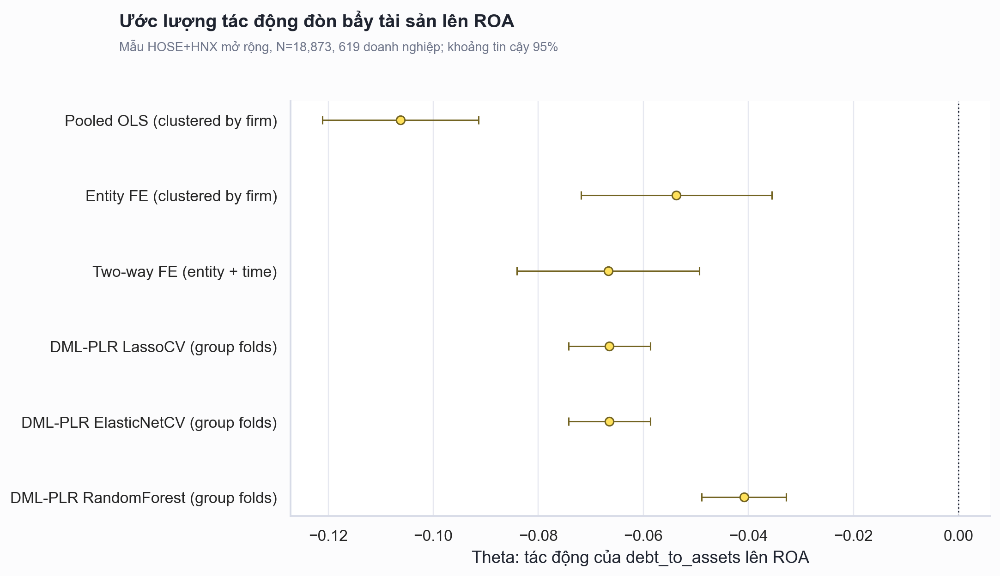
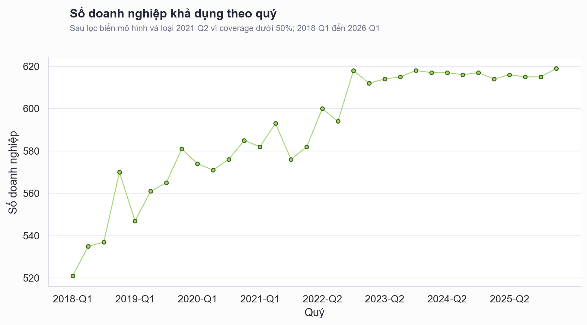

# Kết quả DML trên mẫu mở rộng HOSE và HNX

## Tóm tắt kỹ thuật

Pipeline mới thay thế danh sách hard-code 50 doanh nghiệp bằng toàn bộ cổ phiếu thường phi tài chính trên HOSE và HNX có dữ liệu `vnstock`/VCI và có tối thiểu 12 quan sát quý hợp lệ.

Mẫu phân tích cuối gồm **18,873 quan sát doanh nghiệp-quý** của **619 doanh nghiệp**, trong đó có **343 doanh nghiệp HOSE** và **276 doanh nghiệp HNX**. Phạm vi thời gian là **2018-Q1 đến 2026-Q1**; các quý bị loại do coverage thấp gồm `2021-Q2` đạt 13.7%.

Đặc tả DML-RandomForest sử dụng entity demeaning, biến giả thời gian và cross-fitting theo `ticker` cho kết quả **theta = -0.040849**, **p = 2.932e-23**, khoảng tin cậy 95% **[-0.048908, -0.032790]**. Theo thang đo của mô hình, D/A tăng 0,10 gắn với ROA giảm khoảng **0.408 điểm phần trăm**. Two-way FE cũng cho hệ số âm **-0.066678**, p = 5.414e-14.

Kết quả mới **đảo dấu so với mẫu 50 doanh nghiệp cũ**: thay vì hệ số dương `+0,0313`, toàn bộ sáu đặc tả trên mẫu mở rộng đều cho hệ số âm và có ý nghĩa thống kê. Điều này cho thấy kết luận dương trước đây phụ thuộc mạnh vào cách chọn mẫu blue-chip và không nên được duy trì như kết luận chung cho thị trường.

## Hệ số âm nhất quán trên các mô hình

Nhận xét về kích thước mẫu được xử lý ở tầng chọn đối tượng: mô hình hiện dùng 619 doanh nghiệp thay vì 50 doanh nghiệp được chọn thủ công. Cross-fitting được chia theo doanh nghiệp, nên toàn bộ các quý của cùng một `ticker` chỉ nằm trong train hoặc test ở một fold, tránh leakage giữa các quý của cùng công ty.

| Mô hình | Hệ số | SE | P-value | CI dưới | CI trên | N | Doanh nghiệp |
|---|---:|---:|---:|---:|---:|---:|---:|
| Pooled OLS (clustered by firm) | -0.106252 | 0.007597 | 1.907e-44 | -0.121142 | -0.091362 | 18873 | 619 |
| Entity FE (clustered by firm) | -0.053708 | 0.009259 | 6.610e-09 | -0.071856 | -0.035561 | 18873 | 619 |
| Two-way FE (entity + time) | -0.066678 | 0.008865 | 5.414e-14 | -0.084053 | -0.049303 | 18873 | 619 |
| DML-PLR LassoCV (group folds) | -0.066482 | 0.003969 | 5.569e-63 | -0.074261 | -0.058704 | 18873 | 619 |
| DML-PLR ElasticNetCV (group folds) | -0.066474 | 0.003969 | 5.746e-63 | -0.074253 | -0.058695 | 18873 | 619 |
| DML-PLR RandomForest (group folds) | -0.040849 | 0.004112 | 2.932e-23 | -0.048908 | -0.032790 | 18873 | 619 |

## Coverage dữ liệu theo quý

Panel được giữ ở dạng không cân bằng: doanh nghiệp có thể vào mẫu sau khi niêm yết và không có dòng khi VCI không trả dữ liệu. Pipeline không forward-fill hoặc tự tạo tỷ số tài chính cho các quý thiếu.

Quý bị loại do coverage thấp:

- `2021-Q2`: 85/619 doanh nghiệp (13.7%).

## Phạm vi và định nghĩa biến

- **Universe:** ảnh chụp cổ phiếu thường đang niêm yết trên HOSE và HNX tại thời điểm tải; loại ngân hàng, chứng khoán, bảo hiểm, quỹ và công ty tài chính theo ngành/tên doanh nghiệp.
- **Thời gian:** 2018-Q1 đến 2026-Q1; tỷ số tài chính quý từ VCI.
- **Biến kết quả:** `roa`.
- **Biến can thiệp:** `debt_to_assets = debt_to_equity / (1 + debt_to_equity)`.
- **Biến kiểm soát:** `current_ratio`, `quick_ratio`, `asset_turnover`, `gross_margin`, `log_market_cap`.
- **Rule doanh nghiệp:** tối thiểu 12 quan sát hợp lệ.
- **Rule coverage theo quý:** loại quý có dưới 50% số doanh nghiệp; quý bị loại: `2021-Q2`.
- **Outlier:** winsorize các biến mô hình tại phân vị 1% và 99% trước entity demeaning.

## Phương pháp

Phân tích gồm ba baseline kinh tế lượng và ba đặc tả DML-PLR:

- Pooled OLS với sai số chuẩn cluster theo doanh nghiệp.
- Entity Fixed Effects bằng within transformation.
- Two-way FE bằng entity demeaning và biến giả quý.
- DML-PLR với LassoCV, ElasticNetCV và RandomForest.

Các mô hình DML sử dụng 5 folds, 5 repetitions và sample splitting theo `ticker`.

## Các phần đã thực hiện

1. Nâng `vnstock` lên phiên bản 4.0.4 và cập nhật requirements.
2. Tạo universe 702 cổ phiếu thường HOSE/HNX, lọc còn 635 doanh nghiệp phi tài chính.
3. Tải 19,132 dòng tỷ số tài chính quý và ghi checkpoint/failure log.
4. Tạo master panel, tính `debt_to_assets` và `log_market_cap`.
5. Áp rule tối thiểu 12 quý và rule coverage theo quý, tạo mẫu 619 doanh nghiệp; quý bị loại: `2021-Q2`.
6. Winsorize 1%-99%, chạy OLS, FE, Two-way FE và ba DML với group folds.
7. Chạy kiểm tra 5 random seeds và robustness với ngưỡng tối thiểu 16 quý.
8. Xuất bảng kết quả, biểu đồ và báo cáo kỹ thuật này.

## Hạn chế và kiểm định độ bền

- `vnstock`/VCI là lớp trích xuất dữ liệu, không phải cơ sở dữ liệu học thuật đã được kiểm toán độc lập.
- Universe lấy từ danh sách đang niêm yết tại thời điểm tải, chưa tái dựng các mã đã hủy niêm yết trong lịch sử; do đó vẫn có nguy cơ survivorship bias.
- Dữ liệu VCI có coverage thấp tại `2021-Q2`; các quý này được giữ trong master nhưng loại khỏi model.
- Rule loại ngành tài chính dựa trên ngành/từ khóa nên vẫn cần kiểm tra thủ công trước khi nộp.
- Kiểm tra 5 seeds của RandomForest cho theta trung bình -0.041349; khoảng theta [-0.041664, -0.041019].
- Với ngưỡng tối thiểu 16 quý, mẫu còn 609 doanh nghiệp và RandomForest DML cho theta = -0.040839, p = 2.06e-23.
- DML-PLR không tự giải quyết nội sinh từ biến không quan sát hoặc quan hệ nhân quả ngược nếu không có biến công cụ. Vì vậy kết quả không nên được mô tả như bằng chứng nhân quả tuyệt đối.

## Bước tiếp theo

1. Đối chiếu ngẫu nhiên một số doanh nghiệp với báo cáo tài chính gốc hoặc nguồn thứ hai.
2. Chạy robustness riêng cho HOSE, HNX, doanh nghiệp niêm yết liên tục và từng ngành.
3. Cân nhắc DML-PLIV hoặc chiến lược nhận dạng mạnh hơn nếu luận văn cần tuyên bố nhân quả.
4. Cập nhật phần abstract, kết luận và thảo luận của paper cũ vì dấu hệ số đã thay đổi.

## Câu hỏi nghiên cứu tiếp theo

- Tác động có khác nhau theo sàn, ngành hoặc quy mô doanh nghiệp không?
- Kết quả có thay đổi khi chỉ giữ doanh nghiệp niêm yết liên tục trong toàn kỳ không?
- Missing data của VCI có tập trung theo ngành/sàn hay không?
